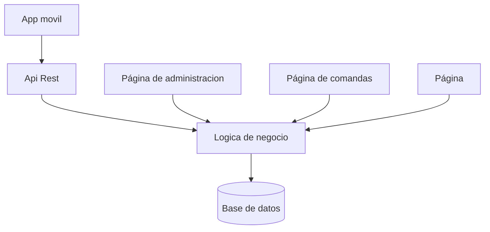
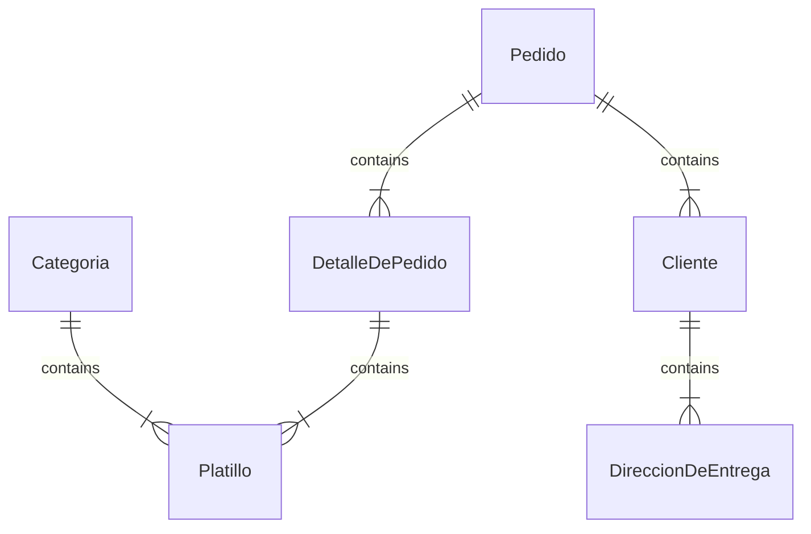

# EntregasADomicilio

# Objetivo

En el ambito laboral la mayoria de proyectos donde se trabajan ya estan iniciados o son platillas. En este proyecto tendra construido algunos modulos y otros se completaran para que vean la integración de elementos y creación de modulos.

Lucky sushi es un restaurant de comida japonesa, el cual tiene una app para que realices tu pedido, el pago es contraentrega, ya sea en efectivo o pago con tarjeta.

El sistema cuenta a grandes rasgos con os siguientes componentes.

**App movil**, donde el usuario realiza el pedido, previo registro de datos generales y domicilio.

**Página administrativa** donde se gestionan los platillos y promociones.

**Página de comandas**, donde los encargados de cocina ven los pedidos y cambian es estatus del pedido y se indica al repartidor la entrega y el metodo de pago.
## Diagrama del sistema

## Entidad relaciones

## Herramientas a usar

Github/Git para respaldar el codigo y hacer integraciones

Visual Studio IDE, para el desarrollo del sistema

SqlServer, motor de base de datos

Management Studio, visor de base de datos

Docker, administrador de imagenes y contenedores
